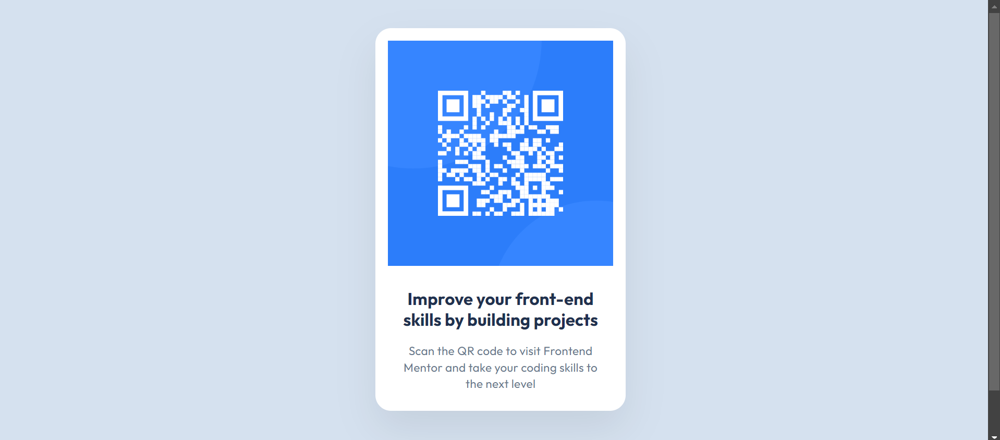

# Frontend Mentor - QR code component solution

This is a solution to the [QR code component challenge on Frontend Mentor](https://www.frontendmentor.io/challenges/qr-code-component-iux_sIO_H). Frontend Mentor challenges help you improve your coding skills by building realistic projects.

## Table of contents

- [Overview](#overview)
  - [Screenshot](#screenshot)
  - [Links](#links)
- [My process](#my-process)
  - [Built with](#built-with)
  - [What I learned](#what-i-learned)
  - [Continued development](#continued-development)

## Overview

This is my solution to building QR code Component for Frontend Mentor using HTML & CSS

### Screenshot



### Links

- Solution URL: [Add solution URL here](https://your-solution-url.com)
- Live Site URL: [Add live site URL here](https://your-live-site-url.com)

## My process

### Built with

- Semantic HTML5 markup
- CSS custom properties
- Flexbox
- Desktop-first workflow

### What I learned

While working on the project I learned to use HTML elements with semantic meaning, I also learned to use css variable, css resposive units(rems) etc.

Here are few examples:

```html
<article>
  <h1>Heading required</h1>
</article>
```

```css
:root {
  --slate-300: #d5e1ef;
}

html {
  /* Set the font size to 10px, (10/16)*100 = 62.5% */
  font-size: 62.5%;
}
.heading {
  font-size: 3.6rem;
  /* Using the css variable */
  background-color: var(--slate-300);
}
```

### Continued development

In the futire I'll focus on mastering front end development, including getting comfortable working with front end frameworks and libraries such as html, css, vanilla javascript, react, and more.

## Author

<!-- - Website - [Add your name here](https://www.your-site.com)
- Frontend Mentor - [@yourusername](https://www.frontendmentor.io/profile/yourusername)
- Twitter - [@yourusername](https://www.twitter.com/yourusername) -->
